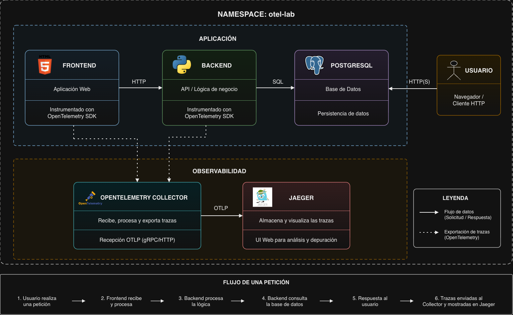

# CRC OpenTelemetry Tracing Lab

Laboratorio desplegado sobre OpenShift Local (CRC) cuyo objetivo es aprender y demostrar el funcionamiento de OpenTelemetry, las trazas distribuidas y la correlación entre logs, Trace IDs y Span IDs.

## Objetivo

El objetivo principal del proyecto es ser capaz de seguir una petición de extremo a extremo a través de varios servicios y responder preguntas como:

- ¿Dónde se ha producido un error?
- ¿Qué servicios han participado en una petición?
- ¿Cuál ha sido el recorrido completo de una solicitud?
- ¿Qué operación concreta ha fallado?
- ¿Cómo se relacionan un log, un Trace ID y un Span ID?

Para ello se desplegará una aplicación distribuida sencilla compuesta por frontend, backend y base de datos, instrumentada mediante OpenTelemetry.

## Arquitectura

<p align="center">
  
</p>

## Componentes

### Frontend

Aplicación web sencilla desarrollada con FastAPI y Jinja2.

Responsabilidades:

- Recibir peticiones del usuario.
- Mostrar una interfaz web básica.
- Consumir el backend mediante HTTP.
- Generar y propagar el contexto de trazabilidad.

### Backend

API REST desarrollada con FastAPI.

Responsabilidades:

- Procesar la lógica de negocio.
- Consultar PostgreSQL.
- Generar logs estructurados.
- Generar spans de negocio y spans SQL mediante OpenTelemetry.

### PostgreSQL

Base de datos utilizada por el backend para persistir información.

No genera trazas directamente. Las operaciones SQL aparecerán en las trazas gracias a la instrumentación OpenTelemetry del backend.

### OpenTelemetry Collector

Recibe las trazas generadas por las aplicaciones y las exporta a Jaeger.

### Jaeger

Backend de trazas utilizado para almacenar y visualizar los traces generados durante las pruebas.

## Qué queremos aprender

Durante el laboratorio se trabajará principalmente con los siguientes conceptos:

### Trace ID

Identificador único de una petición completa.

Ejemplo:

```text
Usuario → Frontend → Backend → PostgreSQL
```

Todo el recorrido comparte el mismo Trace ID.

### Span ID

Identificador único de una operación concreta dentro de un trace.

Ejemplo:

```text
Frontend GET /
Backend GET /users
SELECT users
```

Cada operación genera su propio Span ID.

### Parent Span

Relación jerárquica entre spans.

Ejemplo:

```text
Frontend
└── Backend
    └── SQL Query
```

### Correlación

Capacidad de relacionar:

```text
Error
↓
Log
↓
Trace ID
↓
Trace completo
↓
Span concreto
```

permitiendo localizar rápidamente el origen de un problema.
